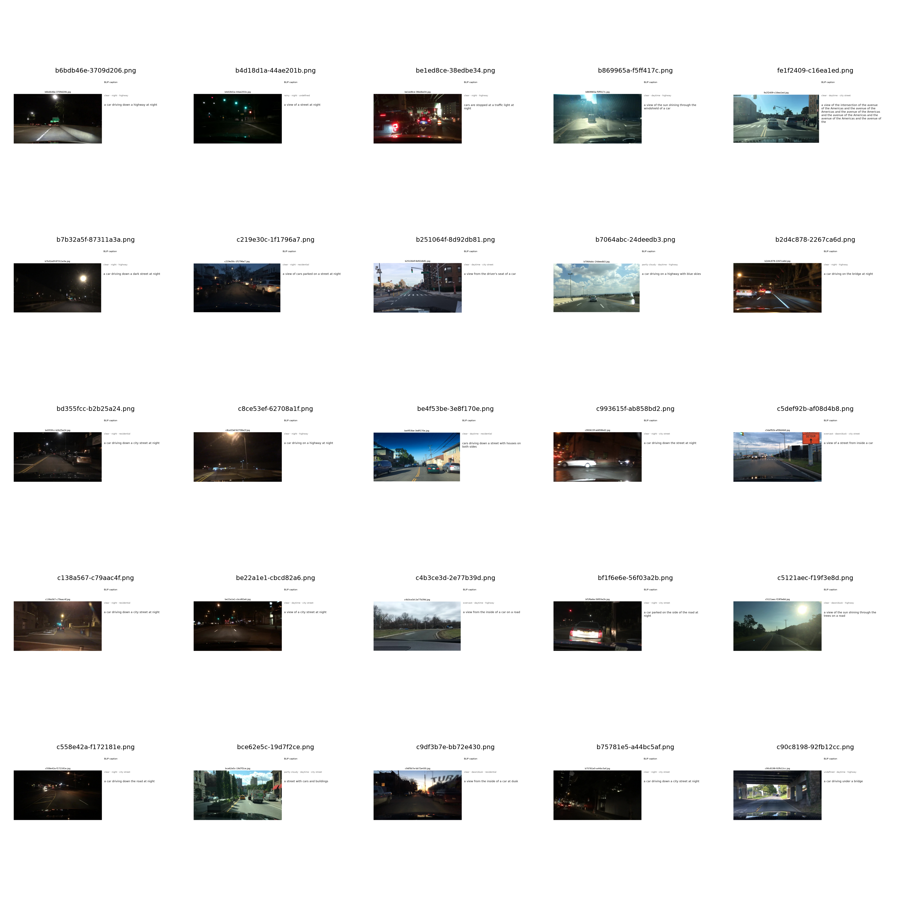

# Driving-Scene BLIP Captioner

Straightforward BLIP-2 image captioning over a local driving-scene dataset,
with a simple side-by-side visualization: **image on the left, generated
caption on the right**, rendered for every image.

This is not working like CLIP that we have used before here it describes the images itself so in case we added states of the vechile to it we can reach making VLA. But this will be mentioned Later.

Built on a local sample of [BDD100K]([https://bdd-data.berkeley.edu/](https://www.kaggle.com/datasets/solesensei/solesensei_bdd100k))-style
frames: drop images in `data/images/` (and, optionally, a BDD100K-style
label JSON in `data/annotations/`) and the pipeline takes it from there —
no download step required.

<p align="center">
  
  
</p>

## Model

| Role | Model | Why |
|---|---|---|
| Captioning | [`Salesforce/blip2-opt-2.7b`](https://huggingface.co/Salesforce/blip2-opt-2.7b) (~2.7B) | Strong zero-shot image captioning; a single Q-Former bridges a frozen vision encoder to a frozen OPT decoder |

The full model (vision encoder + Q-Former + OPT-2.7b decoder) is ~3.6B
params, not just "2.7B" — per Hugging Face's model memory calculator that's
~7.2GB in fp16, ~3.6GB in int8, and ~1.8GB in int4. `configs/config.yaml`
defaults to **int4** (~1.8GB weights) so it fits a 4GB card. Bump to
`load_in_8bit: true` if you have 6GB+, or turn both off for ≥8GB.

Actually this was the lightest one i can use on my PC.

## Setup

```bash
gif clone <this-repo>
cd Driving_Scene_Captioner_BLIP_only
python -m venv .venv && source .venv/bin/activate
pip install -r requirements.txt
```

## Data

Put your frames here before running anything:

```
data/images/<filename>.jpg           frame images
data/annotations/<one-file>.json     optional single JSON file covering all images
```

The annotations file (optional — used only to label each figure's metadata
line) follows the official BDD100K label shape:

```json
[{"name": "abc.jpg", "attributes": {"weather": "clear", "timeofday": "daytime", "scene": "city street"}}]
```

(a flat `{"filename": ..., "weather": ...}` shape also works). If you skip
annotations entirely, everything still runs — figures just won't show a
weather/time-of-day/scene line.

## Usage

Run end-to-end (dataset sanity-check figures, then BLIP captioning + per-image
visualization):

```bash
python main.py (--config configs/config.yaml ) the config could be ignored as it by default use it

```

## Output

For every image in `data/images/`, you get one figure at
`outputs/captions/figures/<filename>.png` — the source image on the left,
the BLIP-2 caption (and weather/time-of-day/scene, if you supplied
annotations) on the right. The raw `{filename: caption}` mapping is also
written to `outputs/captions/captions.json`.

Also there're five random gifs of 100 images in each one and random fig image

## Repository layout

```
main.py                        Runs the dataset sanity-check + captioning/visualization steps
configs/config.yaml             All settings in one place
data/images/                     Your frame images (not committed)
data/annotations/                Optional single label JSON covering all images (not committed)
src/dataset.py                  Shared dataset/frame loader
src/visualize_dataset.py        Dataset-overview + sample-grid sanity-check figures
src/models/blip_baseline.py     BLIP-2 wrapper (captioning only)
src/caption_and_visualize.py    Runs BLIP-2 over every image, saves image-left/caption
```

## Results
<p align="center">
  
</p>
---
<p align="center">
  
  
  
</p>

=======
